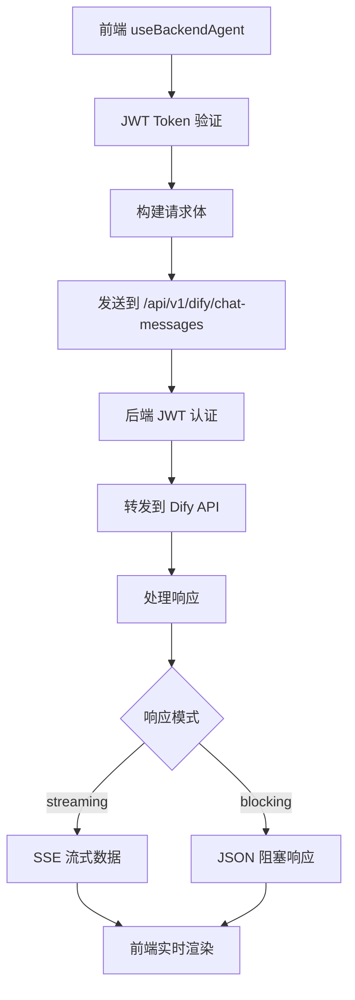

# VectorForge 自定义 Backend Agent 使用指南

## 概述

`useBackendAgent` 是为 VectorForge 项目专门设计的自定义 Agent Hook，它基于 Ant Design X 的 `useXAgent`，但完全适配了我们的后端 API 架构。

## 核心特性

- ✅ **JWT 认证**: 自动从 Redux Store 或 SessionStorage 获取 JWT Token
- ✅ **流式响应**: 支持 Server-Sent Events (SSE) 实时数据流
- ✅ **阻塞式响应**: 支持传统的 HTTP 请求-响应模式
- ✅ **错误处理**: 完整的错误处理和用户反馈
- ✅ **请求取消**: 支持 AbortController 中断请求
- ✅ **类型安全**: 完整的 TypeScript 类型支持

## API 对比

### ❌ 原始 useXAgent (直连第三方 API)
```typescript
// 直接调用 DeepSeek API，不安全，暴露 API Key
const [agent] = useXAgent<BubbleDataType>({
  baseURL: 'https://api.deepseek.com/chat/completions',
  model: 'deepseek-chat',
  dangerouslyApiKey: import.meta.env.VITE_DEEPSEEK_API_KEY, // ❌ 前端暴露密钥
});
```

### ✅ 自定义 useBackendAgent (安全代理)
```typescript
// 通过 VectorForge 后端代理，安全且统一
const [agent] = useStreamingBackendAgent();
// 或
const [agent] = useBackendAgent({ 
  response_mode: 'streaming',
  baseURL: '/api/v1/dify' 
});
```

## 使用方法

### 1. 基本用法

```typescript
import { useStreamingBackendAgent } from '../hooks/useBackendAgent';
import { useXChat } from '@ant-design/x';

function ChatComponent() {
  // 创建后端 Agent
  const [agent] = useStreamingBackendAgent();
  
  // 获取请求状态
  const loading = agent.isRequesting();
  
  // 配置 XChat
  const { onRequest, messages, setMessages } = useXChat({
    agent,
    transformMessage: (info) => {
      const { originMessage, chunk } = info || {};
      let currentContent = '';
      
      try {
        if (chunk?.data && !chunk?.data.includes('DONE')) {
          const eventData = JSON.parse(chunk?.data);
          
          // 处理 VectorForge 后端的事件格式
          if (eventData.event === 'message_delta' && eventData.delta) {
            currentContent = eventData.delta;
          } else if (eventData.event === 'workflow_finished' && eventData.data?.outputs?.answer) {
            currentContent = eventData.data.outputs.answer;
          }
        }
      } catch (error) {
        console.error('解析消息失败:', error);
      }

      return {
        content: `${originMessage?.content || ''}${currentContent}`,
        role: 'assistant',
      };
    },
  });

  // 发送消息
  const handleSubmit = (message: string) => {
    onRequest({
      stream: true,
      message: { role: 'user', content: message },
    });
  };

  return (
    // UI 组件...
  );
}
```

### 2. 高级配置

```typescript
import { useBackendAgent } from '../hooks/useBackendAgent';

// 自定义配置
const [agent] = useBackendAgent({
  baseURL: '/api/v1/dify',           // 自定义 API 基础路径
  response_mode: 'streaming',        // 'streaming' | 'blocking'
});

// 或使用便捷方法
const [streamingAgent] = useStreamingBackendAgent();  // 流式
const [blockingAgent] = useBlockingBackendAgent();    // 阻塞式
```

### 3. 错误处理

```typescript
const { onRequest, messages } = useXChat({
  agent,
  requestFallback: (_, { error }) => {
    if (error.name === 'AbortError') {
      return {
        content: '请求已取消',
        role: 'assistant',
      };
    }
    
    // JWT 过期或认证失败
    if (error.message.includes('未登录')) {
      return {
        content: '登录已过期，请重新登录',
        role: 'assistant',
      };
    }
    
    return {
      content: `请求失败：${error.message}`,
      role: 'assistant',
    };
  },
});
```

## 架构流程



## 数据格式

### 请求格式
```typescript
interface BackendRequestInput {
  messages?: BackendMessage[];
  message?: BackendMessage;
  conversation_id?: string;
  inputs?: Record<string, any>;
  response_mode?: 'streaming' | 'blocking';
}
```

### 流式响应格式
```typescript
// SSE 事件格式
data: {"event": "message_delta", "delta": "你好", "conversation_id": "conv_123"}
data: {"event": "workflow_finished", "data": {"outputs": {"answer": "完整回答"}}}
data: {"event": "message_end", "metadata": {"usage": {...}}}
```

### 阻塞式响应格式
```json
{
  "event": "message",
  "answer": "你好！我是AI助手...",
  "conversation_id": "conv_123",
  "message_id": "msg_456",
  "metadata": {
    "usage": {"total_tokens": 150}
  }
}
```

## 与原版 useXAgent 的差异

| 特性 | 原版 useXAgent | 自定义 useBackendAgent |
|------|---------------|----------------------|
| **安全性** | ❌ 前端暴露 API Key | ✅ 后端安全代理 |
| **认证** | ❌ 无认证机制 | ✅ JWT Token 认证 |
| **数据存储** | ❌ 无存储 | ✅ 自动保存到数据库 |
| **错误处理** | ⚠️ 基础错误处理 | ✅ 完整错误处理 |
| **可扩展性** | ❌ 固定第三方 API | ✅ 可配置多种后端 |

## 最佳实践

### 1. 统一使用自定义 Agent
```typescript
// ✅ 推荐：使用自定义 Backend Agent
import { useStreamingBackendAgent } from '../hooks/useBackendAgent';

// ❌ 避免：直接使用原版 useXAgent
import { useXAgent } from '@ant-design/x';
```

### 2. 合理处理认证失败
```typescript
// 监听认证错误，自动跳转登录
const handleAuthError = (error: Error) => {
  if (error.message.includes('未登录')) {
    window.location.href = '/login';
  }
};
```

### 3. 优化用户体验
```typescript
// 显示加载状态
const loading = agent.isRequesting();

// 提供取消功能
const abortController = useRef<AbortController>(null);
const handleCancel = () => {
  abortController.current?.abort();
};
```

## 故障排除

### 常见问题

1. **"未登录，请先登录"**
   - 检查 JWT Token 是否存在
   - 确认 Token 是否过期
   - 验证 Redux Store 状态

2. **"请求失败: 401"**
   - Token 格式错误
   - 后端认证配置问题

3. **流式数据解析失败**
   - 检查后端 SSE 格式
   - 确认事件数据结构

### 调试技巧

```typescript
// 开启详细日志
const [agent] = useBackendAgent({
  response_mode: 'streaming'
});

// 监听所有事件
const { onRequest } = useXChat({
  agent,
  transformMessage: (info) => {
    console.log('收到数据:', info); // 调试用
    // 处理逻辑...
  },
});
```

## 总结

自定义的 `useBackendAgent` 为 VectorForge 项目提供了：

- 🔒 **更安全**的 API 调用方式
- 🚀 **更好**的开发体验
- 📊 **完整**的数据记录
- 🎯 **统一**的错误处理

它是对 Ant Design X 原版 `useXAgent` 的增强，专门为我们的业务场景设计。 